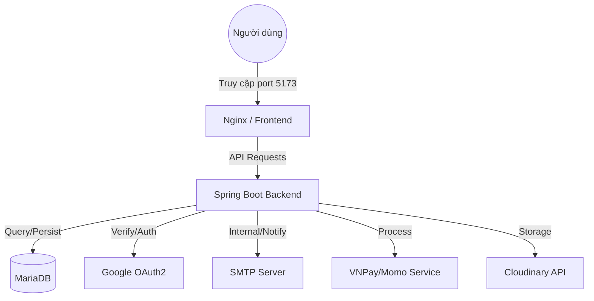

# HotelLink - Hệ Thống Quản Lý Đặt Phòng Khách Sạn

## 📝 Giới thiệu dự án
HotelLink là một nền tảng quản lý đặt phòng khách sạn hiện đại, giúp kết nối người dùng với các dịch vụ lưu trú. Hệ thống hỗ trợ tìm kiếm phòng, đặt phòng trực tuyến, quản lý thông tin cá nhân và tích hợp các cổng thanh toán phổ biến tại Việt Nam.

**Chức năng chính:**
- Tìm kiếm và lọc phòng khách sạn theo nhiều tiêu chí.
- Đặt phòng và quản lý lịch sử đặt phòng.
- Tích hợp thanh toán qua VNPay và Momo.
- Quản lý thông tin tài khoản và đăng nhập qua Google OAuth2.
- Gửi email xác nhận đặt phòng tự động.
- Quản lý hình ảnh linh hoạt với Cloudinary.

**Các vai trò trong hệ thống (Roles):**
**Các vai trò và tính năng chi tiết:**

### 👤 Khách hàng (Customer)
- **Đăng ký & Đăng nhập**: Hỗ trợ đăng ký tài khoản mới, đăng nhập bằng email/mật khẩu hoặc Google OAuth2.
- **Quản lý tài khoản**: Thay đổi thông tin cá nhân, ảnh đại diện, đổi mật khẩu và quên mật khẩu (xác thực qua Email).
- **Tìm kiếm & Đặt phòng**: 
  - Xem danh sách và chi tiết các loại phòng (Room Types).
  - Tìm kiếm phòng trống theo thời gian check-in/check-out.
  - Quy trình đặt phòng (Booking) tích hợp chọn dịch vụ đi kèm.
- **Thanh toán**: Tích hợp cổng thanh toán VNPay và Momo (Sandbox).
- **Lịch sử & Đánh giá**:
  - Xem lịch sử đặt phòng và trạng thái thanh toán.
  - Gửi đánh giá và bình luận cho các loại phòng đã trải nghiệm.

### 🧑‍💼 Nhân viên (Staff / Employee)
- **Quản lý đặt phòng (Booking Management)**: 
  - Tạo đơn đặt phòng trực tiếp cho khách.
  - Tìm kiếm và lọc đơn đặt phòng nâng cao.
  - Thực hiện quy trình **Check-in** và **Check-out** chuyên nghiệp.
  - **Thêm dịch vụ (Add Services)** vào đơn đặt phòng hiện có.
  - **Xem trước hóa đơn (Preview Checkout)** trước khi thanh toán.
  - Cập nhật trạng thái đơn đặt phòng.
- **Theo dõi tình trạng**: Xem sơ đồ phòng trống và danh sách loại phòng theo thời gian thực.
- **Dashboard**: Thống kê nhanh các chỉ số vận hành cơ bản.

### 🔑 Quản trị viên (Admin)
*Toàn quyền quản trị hệ thống và cấu hình danh mục:*
- **Quản lý danh mục (Catalog Management)**:
  - **Loại phòng & Phòng**: Quản lý chi tiết các hạng phòng, giá, số phòng, tầng.
  - **Tiện nghi & Giường**: Cấu hình các loại tiện nghi (Amenities) và loại giường (Beds) cho từng phòng.
  - **Dịch vụ**: Quản lý danh sách dịch vụ đi kèm của khách sạn.
- **Quản lý người dùng**:
  - **Nhân viên (Staff)**: Tuyển dụng, tạo tài khoản và quản lý trạng thái hoạt động của nhân viên.
  - **Khách hàng**: Xem thông tin và quản lý danh sách khách hàng.
- **Quản lý nội dung & Phản hồi**: Kiểm duyệt và quản lý các đánh giá (Reviews) từ khách hàng.
---

## 🏗️ Kiến trúc hệ thống
Dự án được xây dựng theo kiến trúc **Client-Server** (Decoupled Monolith), phân chia rõ ràng trách nhiệm giữa Frontend và Backend:

### 🔙 Backend (Server-side)
- **Kiến trúc**: Layered Architecture (Kiến trúc phân lớp).
- **Các lớp chính**:
  - **Controller**: Tiếp nhận request, điều hướng và phản hồi kết quả (REST API).
  - **Service**: Xử lý logic nghiệp vụ, tính toán và điều phối dữ liệu.
  - **Repository (Data Access)**: Tương tác với cơ sở dữ liệu qua Spring Data JPA.
  - **DTO (Data Transfer Object)**: Định nghĩa cấu trúc dữ liệu trao đổi giữa các lớp.
- **Công nghệ**: Spring Boot, Spring Security (JWT), MariaDB.

### 🎨 Frontend (Client-side)
- **Kiến trúc**: **Component-based Architecture** kết hợp với mô hình quản lý trạng thái tập trung.
- **Quản lý trạng thái (State Management)**: Sử dụng **Redux Toolkit** để quản lý luồng dữ liệu đồng nhất trên toàn ứng dụng.
- **Routing**: React Router DOM cho việc điều hướng trang.
- **Styling**: Tailwind CSS & Shadcn UI cho giao diện hiện đại và responsive.

### 🔄 Luồng tương tác
1.  **Frontend**: Gửi RESTful API Request (axios) đính kèm JWT token.
2.  **Nginx**: Nhận request, phục vụ các file tĩnh (HTML/JS/Images) và proxy các request `/api/**` về Backend.
3.  **Backend**: Kiểm tra quyền truy cập (Security), xử lý logic (Service), truy vấn dữ liệu (Repository) và trả về JSON.
4.  **Database**: MariaDB lưu trữ dữ liệu tập trung cho hệ thống.

---

## 🎨 Design Patterns áp dụng
Dự án áp dụng các mẫu thiết kế phổ biến để đảm bảo mã nguồn dễ bảo trì và mở rộng:

### 🔙 Backend (Spring Boot)
- **MVC (Model-View-Controller)**: Phân tách logic xử lý, dữ liệu và giao diện (API).
- **Dependency Injection (DI) & IoC**: Quản lý sự phụ thuộc giữa các object thông qua Spring Container.
- **Repository Pattern**: Tách biệt logic truy xuất dữ liệu khỏi logic nghiệp vụ.
- **Service Pattern**: Đóng gói logic nghiệp vụ vào các lớp Service để tái sử dụng.
- **DTO (Data Transfer Object) Pattern**: Kiểm soát chính xác dữ liệu trả về cho Client, tăng tính bảo mật và hiệu suất.
- **Singleton Pattern**: Các Service và Repository được quản lý như các Beans duy nhất trong Spring context.

### 🎨 Frontend (React)
- **Component-Based Architecture**: Xây dựng giao diện từ các thành phần nhỏ, độc lập.
- **Flux / Redux Pattern**: Quản lý trạng thái ứng dụng một cách nhất quán thông qua Actions và Reducers (Redux Toolkit).
- **Hooks Pattern**: Tái sử dụng logic (stateful logic) giữa các component một cách linh hoạt.
- **Layout Pattern**: Sử dụng các component bọc (Wrapper) để định nghĩa cấu trúc trang chung.
- **Container-Presenter Pattern**: Tách biệt logic xử lý dữ liệu (store, hooks) và hiển thị giao diện.



---

## 💻 Công nghệ sử dụng
- **Frontend**: React 19, Vite, Tailwind CSS, Shadcn UI, Redux Toolkit, Framer Motion.
- **Backend**: Java 21, Spring Boot 4.0.0, Spring Security, Spring Data JPA, Hibernate, OpenFeign.
- **Database**: MariaDB 11.
- **Containerization**: Docker, Docker Compose.
- **Web Server**: Nginx.
- **Third-party Services**: Cloudinary, VNPay, Momo, Google Console.

---

## 📋 Yêu cầu hệ thống
Trước khi bắt đầu, hãy đảm bảo máy bạn đã cài đặt:
- **Docker**: Phiên bản 20.10 trở lên.
- **Docker Compose**: Phiên bản 2.0 trở lên.
- **Cổng (Ports) khả dụng**: 5173 (Frontend) và 8080 (Backend).

---

## 🚀 Hướng dẫn cài đặt và chạy bằng Docker

### 1. Clone project
```bash
git clone https://github.com/phamthanhtrivn/HotelLink.git
cd HotelLink
```

### 2. Tạo file `.env`
Sao chép file `.env.example` thành `.env` và điền đầy đủ các thông tin cần thiết:
```bash
cp .env.example .env
```
*(Chi tiết các biến môi trường có thể liên hệ nếu muốn chạy thử)*

### 3. Chạy hệ thống
Sử dụng Docker Compose để build và khởi chạy toàn bộ dịch vụ:
```bash
docker compose up --build
```

### 4. Truy cập hệ thống
- **Frontend**: [http://localhost:5173](http://localhost:5173)
- **Backend API**: [http://localhost:8080](http://localhost:8080)
- **Database**: Port 3306 (nếu cần truy cập trực tiếp từ host).

---

## 📁 Cấu trúc thư mục chính
```text
HotelLink/
├── backend/            # Mã nguồn Spring Boot backend
│   ├── src/            # Java code & resources
│   └── Dockerfile      # Docker config cho backend
├── frontend/           # Mã nguồn React frontend
│   ├── src/            # React components, pages, redux
│   ├── nginx.conf      # Cấu hình Nginx cho frontend
│   └── Dockerfile      # Docker config cho frontend
├── docker-compose.yml  # File điều phối các dịch vụ Docker
├── .env.example        # Mẫu các biến môi trường
└── .gitignore          # File loại trừ git
```

---

## 🔐 Biến môi trường (.env)

| Biến | Ý nghĩa | Mặc định/Ví dụ |
| :--- | :--- | :--- |
| `DB_ROOT_PASSWORD` | Mật khẩu root của MariaDB | `your_root_password` |
| `DB_USERNAME` | Tên người dùng database | `your_db_username` |
| `DB_PASSWORD` | Mật khẩu người dùng database | `your_db_password` |
| `JWT_SECRET` | Khóa bí mật dùng để ký JWT | `your_secret_here` |
| `GOOGLE_CLIENT_ID` | Client ID từ Google Console | `your_google_client_id` |
| `GOOGLE_CLIENT_SECRET` | Client Secret từ Google Console | `your_google_client_secret` |
| `EMAIL_APP_PASSWORD` | Mật khẩu ứng dụng của Gmail | `your_app_password` |
| `FRONTEND_URL` | URL của frontend | `http://localhost:5173` |
| `BACKEND_URL` | URL của backend | `http://localhost:8080` |
| `VNPAY_*` | Các cấu hình tích hợp VNPay | (Xem trong .env.example) |
| `MOMO_*` | Các cấu hình tích hợp Momo | (Xem trong .env.example) |
| `CLOUDINARY_*` | Cấu hình lưu trữ ảnh Cloudinary | (Xem trong .env.example) |
